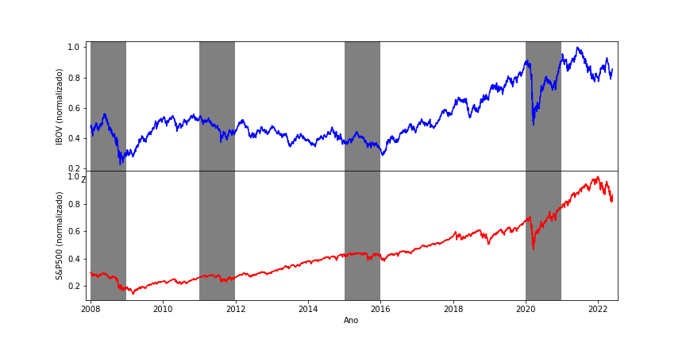
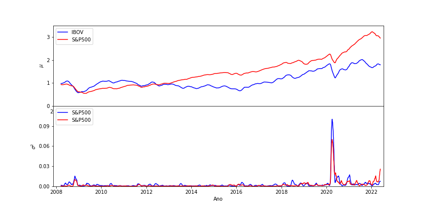
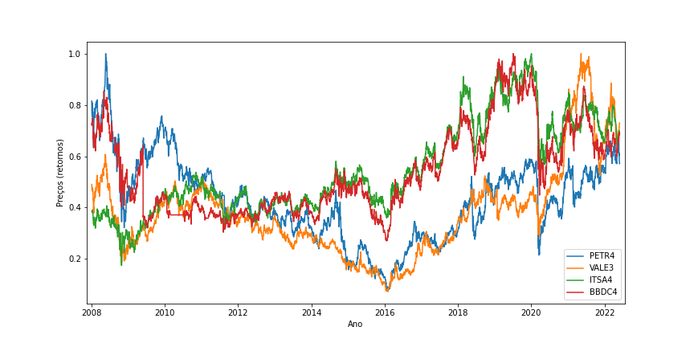
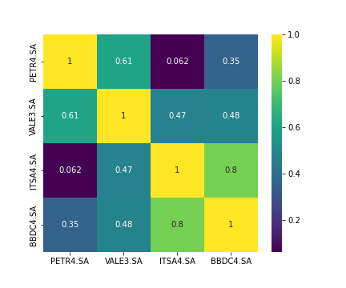
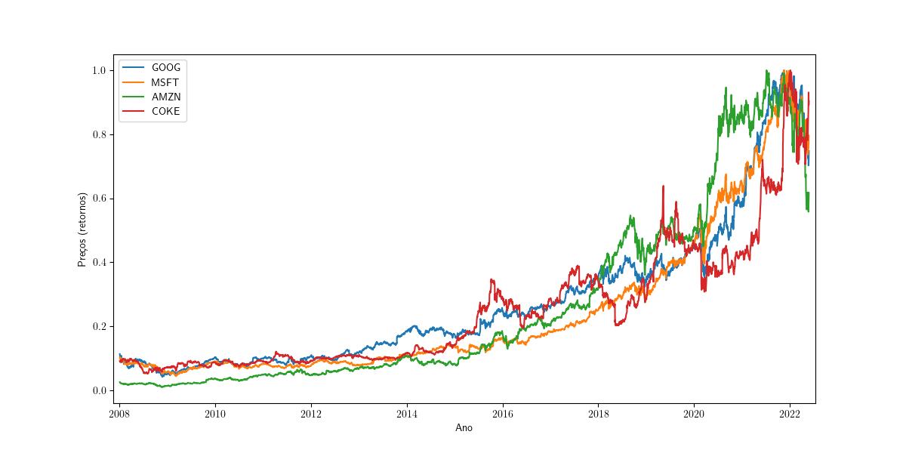
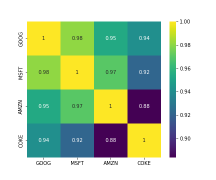

# Otimização de Portfólios de Markowitz [problemas com LaTex e MarkDown]
## Objetivos
- Recolher dados históricos de dois índices (S&P500 e IBOV) para detectarmos períodos de movimentações abruptas;
- Escolher 4 ações de empresas pertencentes a cada um dos índices e calcular os retornos ao longo do tempo e as respectivas variâncias;
- Aplicar o processo de otimização às duas cestas de ativos; exibir o retorno do portifólio otimizado;
- Exibir a fronteira eficiente
- Calcular a curvatura da fronteira eficiente sobre o portifólio eficiente;
- A curvatura sobre o portifólio eficiente pode ser útil como indicativo de períodos de mudanças abrubtas?
- Apêndice A (detalhamento matemático): breve comentário sobre as duas implementações da otimização. A primeira fixa o retorno e minimiza a variância; e a segunda fixa a variância e maximiza o retorno;
- Apêndice B (detalhamento matemático): curvatura de uma hipérbole

## Dados Histórios S&P500 e IBOV

Utilizando o pacote yfinance, podemos obter dados históricos de diversos ativos, incluindo índices de bolsas de vários países. 

Abaixo expomos dados históricos do índice Ibovespa (IBOV) e do índice S&P500.

O histórico de preços encontra-se nomalizado pelo respectivo valor máximo alcançado por cada ativo, na respectiva moeda. Note que essa normalização não afeta a análise, pois não altera períodos onde ocorrem mudanças abruptas.

Sobre o gráfico, destacamos alguns períodos onde ocorreram mudanças abruptas de preço nos dois índices. A seguir, vamos testar se a curvatura da fronteira eficiente obtida através da otimização de Markowitz expressa algum comportamento relevante nessas regiões.

No gráfico abaixo, vemos o retorno médio de cada índice numa janela de 50 dias úteis (superior); e a variância dos retornos (inferior), na mesma janela de tempo.

Podemos observar que o índice S&P500 entregaram um retorno maior que o índice Ibovespa. Além disso, o gráfico da variância atesta que o índice Ibovespa está sujeito a oscilações maiores e mais frequentes que o índice S&P500, como pode ser observado no gráfico dos históricos de preços.
## Cestas de Ativos

Agora, vamos escolher quatro ativos presentes em cada um dos índices. Vamos exibir gráficos dos preços; calcular os retornos e as variâncias médias; e as correlações entre os ativos de cada cesta.

### Petrobrás, Vale, Itaúsa, Bradesco

A seguir o histórico de preços normalizados de quatro empresas brasileiras: Petrobrás, Vale, Itaúsa e Bradesco. 

No gráfico abaixo, assim como fizemos para os índices, temos os retornos acumulados e as variâncias para as ações na cesta brasileira.

Primeiramente, podemos observar que ação com maior retorno é a da empresa Vale. É também a que possui maior variância. Esta possui um pico muito expressivo em 2020, provavelmente em virtude da oscilação de preços causada pela pandemia do corona vírus.

Podemos ainda calcular a correlação média entre as ações nas cesta.

Podemos observar correlações elevadas entre  Banco Bradesco e Itaúsa e entre Vale e Petrobrás. É provável que a correlação deva-se à semelhança entre os negócios.

### Google, Mycrosoft, Amazon, Coca-Cola

A seguir o histórico de preços normalizados de quatro empresas estadunidenses: Google, Mycrosoft, Amazon e Coca-Cola. 

No gráfico abaixo, assim como fizemos para os índices, temos os retornos acumulados e as variâncias para as ações na cesta brasileira.

Primeiramente, podemos observar que ação com maior retorno é a da empresa Vale. É também a que possui maior variância. Esta possui um pico muito expressivo em 2020, provavelmente em virtude da oscilação de preços causada pela pandemia do corona vírus.

Podemos ainda calcular a correlação média entre as ações nas cesta.

Podemos observar correlações elevadas entre  Banco Bradesco e Itaúsa e entre Vale e Petrobrás. É provável que a correlação deva-se à semelhança entre os negócios.
## Portifólios Otimizados
 
## A Fronteira Eficiente e a Curvatura

## Apêndice A: Otimização de Portifólios de Markowitz
Um portfólio é definido através de um conjunto de ativos $A_1, A_2, ... , A_N$ e a respectiva alocação (percentual) $\alpha_1, \alpha_2, ... , \alpha_N$. Desse modo, $\alpha_1~+~\alpha_2~+~\cdots~+~\alpha_N~=~1$.

Então, **retorno do portfólio** $(\mu)$ é dado pela média ponderada dos retornos individuais

$$\mu = \alpha_1\mu_1 + \alpha_2\mu_2 + \cdots \alpha_N\mu_N,$$

onde $\mu_i$ é o retorno do ativo $A_i$. 

E a variância? A **variância do portfólio** $(\sigma^2)$ também pode ser escrita utilizando-se as variâncias dos ativos $(\sigma_i^2)$. Entretando, temos um momento de segunda ordem, por isso temos a influência de correlações entre os ativos. De forma geral, podemos escrever a variância do portfólio combinado como 

$$ \sigma^2 = \vec{\alpha}^t \Sigma \vec{\alpha},$$

onde $\Sigma$ é a **matriz de correlação** entre os ativos (nessa notação, a alocação $\vec{\alpha}$ é vista como um vetor coluna e $\vec{\alpha}^t$ o seu transposto, um vetor linha). Ela é dada por

$$ \Sigma = \begin{pmatrix}\sigma_1^2 & \rho_{12} & \cdots & \rho_{1N} \\ \rho_{12} & \sigma_2^2 & \cdots & \rho_{2N} \\ \vdots & \vdots & \ddots & \vdots \\ \rho_{1N} & \rho_{2N} & \cdots & \sigma_N^2  \end{pmatrix}. $$

Os elementos na diagonal principal de $\Sigma$ são as variâncias dos ativos $(\sigma_i^2)$. Já os termos fora da diagonal $(\rho_{ij})$ representam correlações entre os ativos. Por exemplo, suponha que o preço do ativo $A_1$ sobe, se o preço do ativo $A_2$ também sobe, eles têm **correlação positiva** $(\rho_{12}>0)$, ao passo que se o preço ativo $A_2$ cai, eles têm **correlação negativa** $(\rho_{12}<0)$. 

Se os ativos não têm correlação, temos $\rho_{12} = 0$. E a variância do portfólio pode ser escrita de maneira muito simples

$$ \sigma^2 = \alpha_1^2\sigma_1^2 + \alpha_2^2\sigma_2^2 + \cdots + \alpha_N^2\sigma_N^2.$$

Podemos formular dois problemas de otimização. Nos dois casos, o intuito é encontrar as alocações $(\alpha_1, \alpha_2, ..., \alpha_N)$ que satisfazem as condições. São eles
1. Maximizar o retorno $ \alpha_1\mu_1 + \alpha_2\mu_2 + \cdots \alpha_N\mu_N $ e fixar a variância, ou seja, temos $\vec{\alpha}^t \Sigma \vec{\alpha} = \sigma_0^2 $;

2. Minimizar a variância $ \vec{\alpha}^t \Sigma \vec{\alpha} $ e fixar um retorno $ \alpha_1\mu_1 + \alpha_2\mu_2 + \cdots \alpha_N\mu_N = \mu_0 $.

Nos dois caso, ainda temos $\alpha_1~+~\alpha_2~+~\cdots~+~\alpha_N~=~1$.

Vamos nos concentrar no segundo caso. Vamos procurar os pontos extremos da seguinte lagrangiana

$$ \mathcal{L} = \frac{1}{2}\vec{\alpha}^t \Sigma \vec{\alpha} + \lambda_1 \left(\mu_0 - \vec{\alpha}^t\mu  \right) + \lambda_2\left(1 - \vec{\alpha}^t\vec{1}\right), $$

onde $\lambda_1$ está relacionado com o vínculo da variância fixada e $\lambda_2$ está relacionado com o vínculo de que as alocações somam $1$ e $\vec{1}$ é o vetor coluna com todos os elementos iguais a $1$. Para isso, calculamos a derivada em relação a $\alpha_k$ e igualamos a zero. A equação obtida é uma componente da seguinte equação vetorial
$$ \Sigma \vec{\alpha} - \lambda_1 \vec{\mu} - \lambda_2\vec{1} = 0.$$

De onde obtemos
$$  \vec{\alpha} =  \lambda_1 \Sigma^{-1}\vec{\mu} + \lambda_2\Sigma^{-1}\vec{1}.$$

Resta determinar $\lambda_1$ e $\lambda_2$. Vamos utilizar as equações de vínculo para obter duas equações e resolver os sistema linear.

$$\mu_0 = \vec{\alpha}^t \vec{\mu} = \lambda_1\vec{\mu}^t\Sigma^{-1}\mu + \lambda_2 \vec{\mu}^t\Sigma^{-1}\vec{1} $$

$$1 = \vec{\alpha}^t\vec{1}= \lambda_1 \vec{\mu}^t\Sigma^{-1}\vec{1} + \lambda_2\vec{1}^t\Sigma^{-1}\vec{1}.$$

Na forma matricial,
$$ \begin{pmatrix}\vec{\mu}^t\Sigma^{-1}\mu & \vec{\mu}^t\Sigma^{-1}\vec{1} \\ \vec{\mu}^t\Sigma^{-1}\vec{1} & \vec{1}^t\Sigma^{-1}\vec{1} \end{pmatrix}\begin{pmatrix} \lambda_1 \\ \lambda_2 \end{pmatrix} = \begin{pmatrix} \mu_0 \\ 1 \end{pmatrix}.$$

Com isso, obtemos um sistema de equações que nos permite obter $\lambda_1$ e $\lambda_2$ e, com isso, calcular as alocações do portfólio eficiente.

Note que se conhecemos $\alpha$ podemos obter a variância do portifólio, $ \sigma^2 = \vec{\alpha}^t \Sigma \vec{\alpha}$, em função de um retorno $\mu_0$ fixado. Utilizando as expressões para $\vec{\alpha}$ podemos mostrar que

$$\sigma^2 = \begin{pmatrix} \lambda_1 & \lambda_2 \end{pmatrix} \begin{pmatrix}\vec{\mu}^t\Sigma^{-1}\mu & \vec{\mu}^t\Sigma^{-1}\vec{1} \\ \vec{\mu}^t\Sigma^{-1}\vec{1} & \vec{1}^t\Sigma^{-1}\vec{1} \end{pmatrix}\begin{pmatrix} \lambda_1 \\ \lambda_2 \end{pmatrix},$$

que por sua vez podem ser expressos em função do retorno fixado, $\mu_0$,

$$\sigma^2 = \begin{pmatrix} \mu_0 & 1 \end{pmatrix} \begin{pmatrix}\vec{\mu}^t\Sigma^{-1}\mu & \vec{\mu}^t\Sigma^{-1}\vec{1} \\ \vec{\mu}^t\Sigma^{-1}\vec{1} & \vec{1}^t\Sigma^{-1}\vec{1} \end{pmatrix}^{-1}\begin{pmatrix} \mu_0 \\ 1 \end{pmatrix}.$$

Dessa forma, obtemos uma curva no plano $\sigma \times \mu_0$, a **fronteira eficiente**. Pode-se mostrar que essa curva é um hipérbole e que encapsula todos os pontos que representam os ativos que compõem o portfólio.

Por fim, devemos escolher o ativo com o maior **Sharpe ratio** que é definida como a razão entre diferença do retorno do ativo e do ativo livre de risco e desvio padrão do ativo (o desvio padrão é a raiz quadrada da variância). Então, o Sharpe ratio do ativo $M$ é

$$SR(M) =  \frac{\mu_M - r}{\sigma_M},$$

onde $r$ é o retorno do ativo livre de risco. No Brasil costuma-se utilizar produtos ligados à taxa selic como ativos livres de risco.

Da forma como é definido, o Sharpe ratio nada mais é do que a inclunação de uma reta no plano $\sigma \times \mu$ que passa pelo ponto ativo livre de risco, o ponto $(0, r)$ e pelo ativo $M$, o ponto $(\sigma_M, \mu_M).$ Segue que o ativo otimizado é o ativo da fronteira eficiente com o maior Sharpe ratio, ou seja, é aquele no qual a reta definida pelo Sharpe ratio é tangente à fronteira eficiente. Para encontrá-lo, notamos que devemos ter

$$ \mu^\prime = \frac{\mu - r}{\sigma} \quad \textrm{ com } \quad \sigma^2 = a\mu^2 + b\mu + c.$$

Derivando implicitamente a equação da fronteira eficiente, conseguimos encontrar uma expressão para $\mu^\prime$, e obter duas equações para podermos encontrar o retorno e o desvio padrão do ativo otimizado

$$ \begin{cases}\sigma^2 = a\mu^2 + b\mu + c \\ 2\sigma^2 = 2a\mu^2 + \left(b - 2r a \right)\mu - rb \end{cases}.$$

Resolvendo as equações, encontramos o retorno e a variância do ativo otimizado

$$\mu = -\frac{rb + 2c}{2ra + b} \quad  \textrm{ e } \quad \sigma^2 = \frac{\left(4ac - b^2\right)}{\left(2ra + b \right)^2}\left(ar^2 + br + c \right).$$

## Apêndice B: A Curvatura de uma Hipérbole

Conforme discutimos no Apêndice A, a fronteira eficiente tem a forma de uma hipérbole no plano $\mu \times \sigma$, que podemos expressar por

$$ \sigma^2 = a\mu^2 + b\mu + c, \textrm{com } a > 0.$$

Para obter a curvatura dessa curva, primeiro devemos obter uma **parametrização** da mesma. Ou seja, duas funções de um mesmo parâmetro, $t$, que fornecem um ponto da curva, $\left( \mu\left(t\right), \sigma\left(t\right)\right)$. Utilizando as funções trigonométricas, podemos definir

$$ \begin{cases} \mu(t) = \sqrt{\frac{c}{a} - \frac{b^2}{4a^2}}\sinh (t) - \frac{b}{2a} \\ \sigma(t) = \sqrt{c - \frac{b^2}{4a}}\cosh (t)\end{cases}.$$

Sabendo que $\cosh^2 (t) - \sinh^2 (t) = 1$, a equação da fronteira eficiente é naturalmente satisfeita. Temos portanto uma parametrização.

Nosso interesse é agora calcular a **curvatura** ao longo da curva. De forma geral, a expressão é um tanto extensa

$$k(t) = \frac{\mu^\prime\sigma^{\prime\prime} - \mu^{\prime\prime}\sigma^\prime}{\left(\left(\mu^\prime\right)^2  + \left(\sigma^\prime \right)^2 \right)^{\frac{3}{2}}}, $$

onde $\mu^\prime$ é a primeira derivada de $\mu$ em relação a $t$ e $\mu^{\prime\prime}$ é a segunda derivada em relação a $t$, analogamente para $\sigma^\prime$ e $\sigma^{\prime\prime}$.

Felizmente as derivadas das funções trigonométricas hiperbólicas possuem relações recorrentes. Isto nos permite simplificar enormemente a expressão da curvatura

$$k(t)= \frac{a}{\sqrt{c - \frac{b^2}{4a}}} \left(\cosh^2(t) + a\sinh^2(t)\right)^{-\frac{3}{2}}.$$

O primeiro ponto de interesse acontece quando $t=0$. Nesse caso, temos uma expressão muito simples para a curvatura

$$k(0)= \frac{a}{\sqrt{c - \frac{b^2}{4a}}}.$$

Mais ainda, podemos expressar a curvatura em termos de $\mu$ e $\sigma$

$$k(\mu, \sigma) = \frac{ac - \frac{b^2}{4}}{\left(\sigma^2 + \left(a\mu + \frac{b}{2}\right)^2\right)^{\frac{3}{2}}}.$$
Isto nos permitirá calcular a curvatura no ponto que representa o portfólio eficiente.

Podemos ainda nos perguntar como é a curvatura no ponto em que a fronteira eficiente intercepta o eixo das abscissas. Isto é, quando $\mu(t)=0$. Isto nos permite obter o respectivo valor de $t$ e, em seguida, a variância desse ponto:
$$ \sigma^2 = \frac{4ac + b^2}{4a}.$$
E assim, conseguimos obter a curvatura da hipérbole nesse ponto.